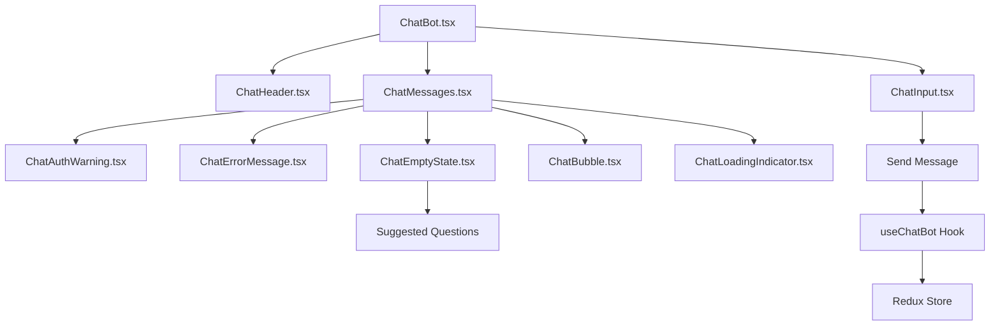

# 🧩 Chat Component Architecture

## 📁 Component Structure

Tính năng ChatBot đã được tách thành các component nhỏ hơn để dễ quản lý, tái sử dụng và maintain.

```
src/components/
├── ChatBot.tsx                    # Main container component
├── ChatFloatingButton.tsx         # Floating action button
└── chat/                          # Chat-specific components
    ├── index.ts                   # Export barrel
    ├── ChatBubble.tsx             # Individual message bubble
    ├── ChatHeader.tsx             # Chat header with controls
    ├── ChatAuthWarning.tsx        # Authentication warning
    ├── ChatErrorMessage.tsx       # Error display component
    ├── ChatEmptyState.tsx         # Empty state with suggestions
    ├── ChatLoadingIndicator.tsx   # Loading animation
    ├── ChatInput.tsx              # Message input with send button
    └── ChatMessages.tsx           # Messages container with scroll
```

## 🎯 Component Responsibilities

### 1. **ChatBot.tsx** - Main Container

```typescript
// Main orchestrator component
interface ChatBotProps {}

// Responsibilities:
- Modal animation & overlay management
- Layout calculations (heights, safe areas)
- State management coordination
- Haptic feedback coordination
```

### 2. **ChatHeader.tsx** - Header Bar

```typescript
interface ChatHeaderProps {
  onClearChat: () => void;
  onClose: () => void;
}

// Features:
- AI assistant branding with robot icon
- Online status indicator
- Clear chat button
- Close button
- Blue gradient background
```

### 3. **ChatMessages.tsx** - Messages Container

```typescript
interface ChatMessagesProps {
  messages: ChatMessage[];
  isLoading: boolean;
  error: string | null;
  isAuthenticated: boolean;
  messagesHeight: number;
  onAuthError: () => void;
  onSuggestedMessage: (message: string) => void;
}

// Features:
- ScrollView with auto-scroll to bottom
- Authentication & error state handling
- Empty state or message list rendering
- Loading indicator management
```

### 4. **ChatBubble.tsx** - Individual Message

```typescript
interface ChatBubbleProps {
  message: ChatMessage;
}

// Features:
- User vs Assistant styling (blue vs gray)
- Rounded bubble design with tail
- Timestamp formatting
- Text wrapping and styling
```

### 5. **ChatInput.tsx** - Message Input

```typescript
interface ChatInputProps {
  onSendMessage: (message: string) => void;
  isLoading: boolean;
  isAuthenticated: boolean;
  inputHeight: number;
}

// Features:
- Multi-line text input with character limit
- Send button with state-based styling
- Authentication-aware placeholder
- Haptic feedback on send
- Lock icon for unauthenticated state
```

### 6. **ChatAuthWarning.tsx** - Authentication Alert

```typescript
interface ChatAuthWarningProps {
  onLogin: () => void;
}

// Features:
- Yellow warning box design
- Alert icon with warning text
- Login button for redirect
- Vietnamese localization
```

### 7. **ChatErrorMessage.tsx** - Error Display

```typescript
interface ChatErrorMessageProps {
  error: string;
  onRetry?: () => void;
}

// Features:
- Red error box with alert icon
- Contextual retry button for auth errors
- Error-specific messaging
- User-friendly Vietnamese messages
```

### 8. **ChatEmptyState.tsx** - Welcome Screen

```typescript
interface ChatEmptyStateProps {
  messagesHeight: number;
  onSuggestedMessage: (message: string) => void;
}

// Features:
- Robot icon with welcome message
- Suggested question buttons
- Professional farm-specific suggestions
- Interactive suggestion selection
```

### 9. **ChatLoadingIndicator.tsx** - Loading Animation

```typescript
// Features:
- Animated typing dots
- "Đang trả lời" message
- Consistent bubble styling
- Simple loading state indication
```

## 🔄 Component Flow



## ✅ Benefits of Component Architecture

### 🎯 **Single Responsibility**

- Each component has ONE clear purpose
- Easy to understand and debug
- Minimal cognitive load

### 🔄 **Reusability**

- Components can be used across different parts
- Consistent UI patterns
- DRY principle applied

### 🧪 **Testability**

- Small, focused components are easier to test
- Isolated unit tests possible
- Mock props and behaviors easily

### 🛠 **Maintainability**

- Changes isolated to specific components
- Easier bug fixes and feature additions
- Clear component boundaries

### 📱 **Performance**

- Smaller component re-renders
- Better React optimization
- Efficient memory usage

## 🎨 Styling Consistency

### **Design System**

```typescript
// Color Palette
const colors = {
  primary: "bg-blue-500", // User messages, send button
  secondary: "bg-gray-200", // Assistant messages
  warning: "bg-yellow-50", // Auth warnings
  error: "bg-red-50", // Error messages
  success: "bg-green-400", // Online indicator
};

// Border Radius
const radius = {
  message: "rounded-2xl", // Message bubbles
  input: "rounded-full", // Input field
  button: "rounded-lg", // Action buttons
  container: "rounded-xl", // Alert containers
};

// Spacing
const spacing = {
  message: "mb-3", // Between messages
  container: "p-4", // Container padding
  button: "px-4 py-2", // Button padding
};
```

### **Typography**

```typescript
const typography = {
  message: "text-base", // Message text
  timestamp: "text-xs", // Time stamps
  header: "text-lg font-bold", // Header titles
  button: "font-medium", // Button text
};
```

## 🔧 Usage Examples

### **Import Components**

```typescript
// Individual imports
import ChatBubble from "./chat/ChatBubble";
import ChatHeader from "./chat/ChatHeader";

// Barrel import
import { ChatBubble, ChatHeader } from "./chat";
```

### **Use in Custom Layout**

```tsx
// Custom chat layout
const CustomChat = () => {
  return (
    <View>
      <ChatHeader onClear={handleClear} onClose={handleClose} />
      <ScrollView>
        {messages.map((msg) => (
          <ChatBubble key={msg.id} message={msg} />
        ))}
      </ScrollView>
      <ChatInput onSend={handleSend} />
    </View>
  );
};
```

### **Test Components**

```typescript
// Example unit test
describe('ChatBubble', () => {
  it('renders user message correctly', () => {
    const message = {
      id: '1',
      text: 'Hello',
      isUser: true,
      timestamp: '2024-01-01T00:00:00Z'
    };

    render(<ChatBubble message={message} />);
    expect(screen.getByText('Hello')).toBeInTheDocument();
  });
});
```

## 📊 Component Metrics

| Component                | Lines of Code | Complexity | Responsibilities      |
| ------------------------ | ------------- | ---------- | --------------------- |
| ChatBot.tsx              | ~100          | High       | Container & Animation |
| ChatMessages.tsx         | ~60           | Medium     | Message Orchestration |
| ChatInput.tsx            | ~80           | Medium     | Input Handling        |
| ChatBubble.tsx           | ~30           | Low        | Message Display       |
| ChatHeader.tsx           | ~40           | Low        | Header UI             |
| ChatAuthWarning.tsx      | ~25           | Low        | Warning Display       |
| ChatErrorMessage.tsx     | ~30           | Low        | Error Display         |
| ChatEmptyState.tsx       | ~50           | Low        | Welcome Screen        |
| ChatLoadingIndicator.tsx | ~20           | Low        | Loading State         |

## 🎯 Future Enhancements

### **Potential New Components**

- `ChatMessageActions.tsx` - Copy, retry, like/dislike
- `ChatVoiceInput.tsx` - Voice message recording
- `ChatFileUpload.tsx` - File attachment support
- `ChatTypingIndicator.tsx` - Real-time typing status
- `ChatSearchBar.tsx` - Message search functionality

### **Performance Optimizations**

- `React.memo()` for pure components
- `useMemo()` for expensive calculations
- `useCallback()` for event handlers
- Virtual scrolling for large message lists

### **Accessibility Improvements**

- Screen reader support
- Keyboard navigation
- Focus management
- High contrast mode

---

## 🎉 Summary

Tính năng chat đã được tách thành **9 components độc lập**, mỗi component có trách nhiệm rõ ràng và có thể tái sử dụng. Architecture này giúp code dễ maintain, test và mở rộng trong tương lai.
